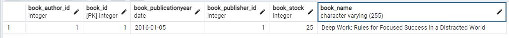
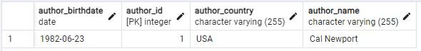
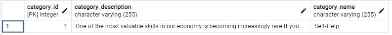
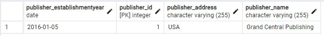
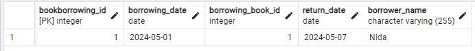
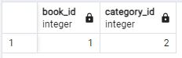

# LIBRARY MANAGEMENT SYSTEM

A library management system was designed using JPA(Java Persistence API).
Representing and relating basic entities such as author, publisher, book, and category.
Managing book borrowing transactions.
Demonstrate the use of JPA to interact with the database.

### Technologies and Libraries Used
- Java 21
- Maven
- JPA
- Hibernate (for JPA implementation)
- PostgreSQL (database)

### Database Tables
Below are screenshots showing the tables created in PostgreSQL database when the project is executed:

- Book Table

  
- Author Table

  
- Category Table

  
- Publisher Table

  
- BookBorrowing Table

  
- CategoryBook Table

  

### Entity Classes and Relationships
Below is a summary of the entity classes created for the project and the relationships between these classes:

**Book**
- id (Unique book identifier)
- name (Book title)
- publicationYear (Year of publication)
- stock (Quantity available in the library)
- author (Many-to-One relationship: Each book belongs to one author)
- categories (Many-to-Many relationship: Each book can belong to multiple categories)
- publisher (Many-to-One relationship: Each book belongs to one publisher)
- borrowings (One-to-Many relationship: Each book can have multiple borrowing records)

**Author**
- id
- name
- birthDate
- country
- books (One-to-Many relationship: Each author can have multiple books)

**Category**
- id
- name
- description
- books (One-to-Many relationship: Each category can have multiple books)

**Publisher**
- id
- name
- establishmentYear
- address
- books (One-to-Many relationship: Each publisher can have multiple books)

**BookBorrowing**
- id
- borrowerName
- borrowingDate
- returnDate (Date the book was returned)

### Project Dependencies
The project is structured as a Maven project, and the necessary dependencies are defined in the [pom.xml](pom.xml) file.

### How to Run
The project is developed as a Java application. Follow these steps to run the project:

- Open the terminal in the project folder.
- Run the command "mvn clean install" in the terminal to download project dependencies and build the project.
- Start the application by running the generated .jar file.

### License
This project is licensed under the MIT License. See the [LICENSE](LICENSE) file for more information.